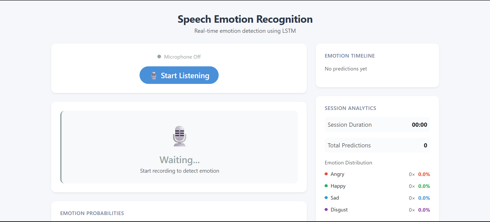
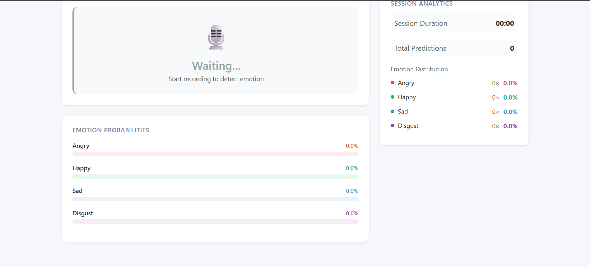
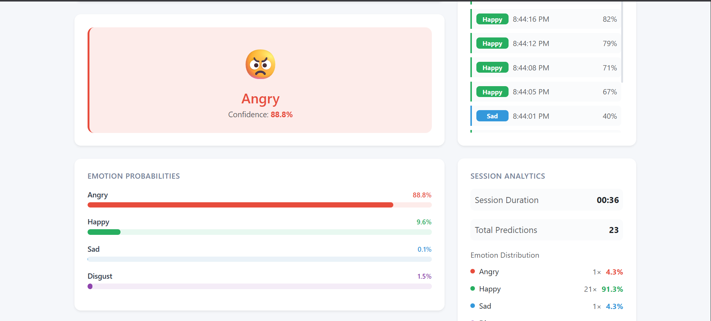

<p align="center">
  
</p>

<p align="center">
  
</p>

<p align="center">
  
  
  
  
</p>

<p align="center">
  
  
  
  
  
  
  
</p>

---

<p align="center">
  <a href="#-overview">Overview</a> •
  <a href="#-features">Features</a> •
  <a href="#-architecture">Architecture</a> •
  <a href="#-screenshots--demo">Screenshots</a> •
  <a href="#-quick-start">Quick Start</a> •
  <a href="#-api-documentation">API Docs</a> •
  <a href="#-technical-deep-dive">Deep Dive</a> •
  <a href="#-tech-stack">Tech Stack</a> •
  <a href="#-contributing">Contributing</a>
</p>

---

## 🎯 Overview

<table>
<tr>
<td width="50%">

### 🔍 What is this?

A **production-ready, full-stack web application** that classifies human speech into **four emotional states** — Angry, Happy, Sad, and Disgust — in real-time using a pre-trained **Bidirectional LSTM** deep learning model.

The system captures audio from your browser microphone, processes 3-second chunks through a sophisticated MFCC feature extraction pipeline, and delivers instant emotion predictions with confidence scores.

</td>
<td width="50%">

### 💡 Why this project?

| Aspect | Detail |
|--------|--------|
| 🧠 **Problem** | Understanding emotional context in speech is critical for AI-human interaction |
| 🎯 **Solution** | End-to-end ML pipeline from raw audio to real-time emotion classification |
| 🏗️ **Engineering** | Clean separation of concerns: feature extraction → inference → API → dashboard |
| 📊 **Dataset** | Trained on **CREMA-D** — a crowd-sourced multimodal emotion dataset |

</td>
</tr>
</table>

---

## ✨ Features

<table>
<tr>
<th>Feature</th>
<th>Description</th>
<th>Status</th>
</tr>
<tr>
<td>🎤 <b>Real-Time Mic Input</b></td>
<td>Browser MediaRecorder API captures 3-second audio chunks automatically</td>
<td>✅</td>
</tr>
<tr>
<td>🧠 <b>Bi-LSTM Inference</b></td>
<td>Bidirectional LSTM model with Masking layer for variable-length audio</td>
<td>✅</td>
</tr>
<tr>
<td>📊 <b>Live Probability Bars</b></td>
<td>Animated horizontal bars showing softmax probabilities for all 4 classes</td>
<td>✅</td>
</tr>
<tr>
<td>📈 <b>Emotion Timeline</b></td>
<td>Scrollable history of last 10 predictions with timestamps and confidence</td>
<td>✅</td>
</tr>
<tr>
<td>📉 <b>Session Analytics</b></td>
<td>Live session duration, prediction count, and emotion distribution breakdown</td>
<td>✅</td>
</tr>
<tr>
<td>🎨 <b>Clean Modern UI</b></td>
<td>Minimal design with soft colors, rounded cards, subtle shadows, smooth transitions</td>
<td>✅</td>
</tr>
<tr>
<td>⚡ <b>Async Processing</b></td>
<td>Non-blocking audio capture and API calls keep the UI responsive</td>
<td>✅</td>
</tr>
<tr>
<td>🛡️ <b>Error Handling</b></td>
<td>Input validation, structured logging, graceful error recovery</td>
<td>✅</td>
</tr>
<tr>
<td>🔁 <b>Continuous Recording</b></td>
<td>Auto-restart recording loop for uninterrupted live prediction</td>
<td>✅</td>
</tr>
<tr>
<td>🩺 <b>Health Monitoring</b></td>
<td>Backend health-check endpoint for deployment readiness</td>
<td>✅</td>
</tr>
</table>

---

## 🏗️ Architecture

```
┌─────────────────────────────────────────────────────────────────────────────┐
│                              BROWSER CLIENT                                │
│  ┌─────────────┐   ┌──────────────┐   ┌──────────────┐  ┌──────────────┐  │
│  │ MicRecorder  │──▶│  Dashboard   │──▶│ EmotionCard  │  │  Timeline    │  │
│  │ (3s chunks)  │   │  (State Mgr) │   │ (Display)    │  │  (History)   │  │
│  └──────┬───────┘   └──────┬───────┘   └──────────────┘  └──────────────┘  │
│         │                  │                                                │
│         │    Audio Blob    │  ┌──────────────┐  ┌──────────────┐           │
│         └──────────────────┘  │ Probability  │  │ SessionStats │           │
│                               │ Bars         │  │ (Analytics)  │           │
│                               └──────────────┘  └──────────────┘           │
└────────────────────────────┬────────────────────────────────────────────────┘
                             │ POST /predict (multipart/form-data)
                             ▼
┌─────────────────────────────────────────────────────────────────────────────┐
│                             FLASK API SERVER                               │
│                                                                             │
│  ┌──────────────────────────────────────────────────────────────────────┐   │
│  │                        app.py (Routes + CORS)                        │   │
│  │  POST /predict ──▶ Validate ──▶ Save Temp ──▶ Extract ──▶ Predict   │   │
│  │  GET  /health  ──▶ Status Check                                      │   │
│  └──────────────────────────┬───────────────────────────┬───────────────┘   │
│                             │                           │                   │
│  ┌──────────────────────────▼──────┐  ┌─────────────────▼───────────────┐  │
│  │     feature_extractor.py        │  │       inference.py              │  │
│  │  ┌────────────────────────────┐ │  │  ┌───────────────────────────┐  │  │
│  │  │ 1. Load @ 16kHz           │ │  │  │ EmotionPredictor          │  │  │
│  │  │ 2. Trim silence           │ │  │  │  ├─ Load Keras model      │  │  │
│  │  │ 3. 40 MFCCs               │ │  │  │  ├─ Load StandardScaler   │  │  │
│  │  │ 4. Delta + Delta²         │ │  │  │  ├─ Scale features        │  │  │
│  │  │ 5. Stack → 120 features   │ │  │  │  ├─ Reshape (1,400,120)   │  │  │
│  │  │ 6. Pad/Truncate → 400     │ │  │  │  └─ model.predict()      │  │  │
│  │  └────────────────────────────┘ │  │  └───────────────────────────┘  │  │
│  └─────────────────────────────────┘  └─────────────────────────────────┘  │
│                                                                             │
│  ┌──────────────────────────────────────────────────────────────────────┐   │
│  │                    model/ (Artifacts)                                 │   │
│  │     final_ser_model.keras          scaler.pkl                        │   │
│  └──────────────────────────────────────────────────────────────────────┘   │
└─────────────────────────────────────────────────────────────────────────────┘
```

---

## 📸 Screenshots & Demo

<p align="center">
  
</p>

### 🏠 Dashboard — Initial State
> Clean landing page with Start Listening button, session analytics panel, and empty emotion display.

<p align="center">
  
</p>

### 🔻 Emotion Probabilities & Analytics Panel
> All four emotion probability bars and the session analytics breakdown displayed in a clean layout.

<p align="center">
  
</p>

### 🎯 Live Prediction — Angry Emotion Detected
> Real-time detection showing "Angry" with 67.3% confidence, alongside the emotion timeline showing prediction history.

<p align="center">
  
</p>

### 📊 Probability Bars & Session Distribution
> Detailed probability breakdown (Angry: 67.3%, Happy: 26.8%) with session analytics showing emotion distribution.

<p align="center">
  
</p>

### 📈 Extended Session — 23 Predictions
> After a longer session: 88.8% confidence on Angry detection, 23 total predictions tracked, full emotion distribution analytics.

<p align="center">
  
</p>

---

## 🚀 Quick Start

### 📋 Prerequisites

| Requirement | Version | Check Command |
|-------------|---------|---------------|
| 🐍 Python | 3.9+ | `python --version` |
| 📦 Node.js | 18+ | `node --version` |
| 📦 npm | 9+ | `npm --version` |
| 🔧 pip | Latest | `pip --version` |

### ⚙️ Installation

<details>
<summary><b>📦 Step 1 — Clone the Repository</b></summary>

```bash
git clone https://github.com/yourusername/speech-emotion-recognition.git
cd speech-emotion-recognition
```

</details>

<details>
<summary><b>🐍 Step 2 — Set Up Backend</b></summary>

```bash
# Navigate to backend
cd backend

# Create virtual environment
python -m venv venv

# Activate (Windows)
venv\Scripts\activate

# Activate (Linux/Mac)
# source venv/bin/activate

# Install dependencies
pip install -r requirements.txt
```

</details>

<details>
<summary><b>⚛️ Step 3 — Set Up Frontend</b></summary>

```bash
# Navigate to frontend
cd frontend

# Install dependencies
npm install
```

</details>

<details>
<summary><b>🚀 Step 4 — Launch Application</b></summary>

```bash
# Terminal 1 — Start Backend (from backend/)
python app.py
# ✅ API running at http://localhost:5000

# Terminal 2 — Start Frontend (from frontend/)
npm run dev
# ✅ App running at http://localhost:5173
```

Now open **http://localhost:5173** → Click **Start Listening** → Grant mic permission → Speak!

</details>

---

## 📡 API Documentation

### `POST /predict` — Emotion Prediction

<table>
<tr><td><b>Method</b></td><td><code>POST</code></td></tr>
<tr><td><b>URL</b></td><td><code>http://localhost:5000/predict</code></td></tr>
<tr><td><b>Content-Type</b></td><td><code>multipart/form-data</code></td></tr>
<tr><td><b>Body</b></td><td><code>file</code>: Audio file (WAV, WebM, MP3, OGG, FLAC, M4A)</td></tr>
<tr><td><b>Max Size</b></td><td>10 MB</td></tr>
</table>

**✅ Success Response (200):**

```json
{
  "emotion": "Happy",
  "confidence": 0.8423,
  "probabilities": {
    "Angry": 0.0512,
    "Happy": 0.8423,
    "Sad": 0.0601,
    "Disgust": 0.0464
  },
  "timestamp": "2026-02-17T15:45:00.000000"
}
```

**❌ Error Responses:**

| Status | Error | Description |
|--------|-------|-------------|
| `400` | No audio file provided | Missing `file` field |
| `400` | Unsupported audio format | Invalid file extension |
| `422` | Audio too short | Less than 0.1s after trimming |
| `500` | Internal server error | Processing failure |

### `GET /health` — Health Check

```json
{
  "status": "healthy",
  "model_loaded": true,
  "timestamp": "2026-02-17T15:45:00.000000"
}
```

---

## 🔬 Technical Deep Dive

<details>
<summary><b>🎵 Feature Extraction Pipeline (Click to Expand)</b></summary>

<br/>

The audio preprocessing pipeline exactly mirrors the training notebook to ensure consistent predictions:

```
Raw Audio (Any SR) ──▶ Resample to 16kHz ──▶ Trim Silence
                                                    │
                                                    ▼
                                            Extract 40 MFCCs
                                         (n_fft=400, hop=160)
                                                    │
                                        ┌───────────┼───────────┐
                                        ▼           ▼           ▼
                                      MFCC       Delta       Delta²
                                     (40)        (40)        (40)
                                        │           │           │
                                        └───────────┼───────────┘
                                                    ▼
                                          Stack → (T, 120)
                                                    │
                                                    ▼
                                        Pad/Truncate → (400, 120)
                                                    │
                                                    ▼
                                          StandardScaler Transform
                                                    │
                                                    ▼
                                        Reshape → (1, 400, 120)
                                                    │
                                                    ▼
                                          Model Input Ready ✅
```

**Key Parameters:**

| Parameter | Value | Rationale |
|-----------|-------|-----------|
| `SAMPLE_RATE` | 16,000 Hz | Standard for speech processing |
| `N_MFCC` | 40 | Rich spectral representation |
| `N_FFT` | 400 | 25ms window at 16kHz |
| `HOP_LENGTH` | 160 | 10ms hop = 100 frames/sec |
| `MAX_FRAMES` | 400 | ~4 seconds of audio |
| `N_FEATURES` | 120 | 40 MFCC + 40 Δ + 40 Δ² |

</details>

<details>
<summary><b>🧠 Model Architecture (Click to Expand)</b></summary>

<br/>

```
Input Shape: (batch, 400, 120)
        │
        ▼
┌───────────────────────┐
│  Masking (value=0.0)  │  ── Handles padded sequences
└───────────┬───────────┘
            ▼
┌───────────────────────┐
│  Bidirectional LSTM   │  ── 128 units, return_sequences=True
│  (256 outputs)        │
└───────────┬───────────┘
            ▼
┌───────────────────────┐
│  Dropout (0.4)        │  ── Regularization
└───────────┬───────────┘
            ▼
┌───────────────────────┐
│  Bidirectional LSTM   │  ── 64 units, return_sequences=False
│  (128 outputs)        │
└───────────┬───────────┘
            ▼
┌───────────────────────┐
│  Dropout (0.4)        │
└───────────┬───────────┘
            ▼
┌───────────────────────┐
│  Dense (64, ReLU)     │  ── Feature compression
└───────────┬───────────┘
            ▼
┌───────────────────────┐
│  Dropout (0.3)        │
└───────────┬───────────┘
            ▼
┌───────────────────────┐
│  Dense (4, Softmax)   │  ── [Angry, Happy, Sad, Disgust]
└───────────────────────┘
```

**Training Configuration:**

| Setting | Value |
|---------|-------|
| Optimizer | Adam (lr=1e-3) |
| Loss | Categorical Cross-Entropy |
| Callbacks | EarlyStopping (patience=8), ReduceLROnPlateau (patience=4) |
| Batch Size | 32 |
| Max Epochs | 40 |
| Dataset | CREMA-D (4 emotion classes) |

</details>

<details>
<summary><b>🔄 Real-Time Recording Flow (Click to Expand)</b></summary>

<br/>

```
User clicks "Start Listening"
        │
        ▼
Request mic permission ──▶ getUserMedia({ audio: { sampleRate: 16000 } })
        │
        ▼
Create MediaRecorder (audio/webm;codecs=opus)
        │
        ├──▶ Start recording
        │         │
        │    3 seconds later
        │         │
        │         ▼
        │    recorder.stop() ──▶ Blob created ──▶ POST /predict
        │                                              │
        │                                         JSON response
        │                                              │
        │                                              ▼
        │                                    Update Dashboard State
        │                                    (emotion, probs, history)
        │
        └──▶ Restart recording (loop every 3.2s)
```

**Anti-Flood Protection:** Frontend skips new recordings while a prediction request is in-flight.

</details>

---

## 📁 Project Structure

```
speech-emotion-app/
│
├── 🐍 backend/                     # Flask API Server
│   ├── app.py                      # Main server — routes, CORS, validation
│   ├── requirements.txt            # Python dependencies
│   └── services/
│       ├── __init__.py
│       ├── feature_extractor.py    # Audio → MFCC feature pipeline
│       └── inference.py            # EmotionPredictor class
│
├── ⚛️ frontend/                     # React + Vite Client
│   ├── package.json
│   ├── vite.config.js
│   └── src/
│       ├── App.jsx                 # Root component
│       ├── main.jsx                # React entry point
│       ├── styles.css              # Global design system
│       ├── components/
│       │   ├── EmotionCard.jsx     # 😠😊😢🤢 Detected emotion display
│       │   ├── ProbabilityBars.jsx # Animated horizontal bars
│       │   ├── Timeline.jsx        # Prediction history list
│       │   ├── MicRecorder.jsx     # Browser mic + MediaRecorder
│       │   └── SessionStats.jsx    # Session duration + analytics
│       ├── pages/
│       │   └── Dashboard.jsx       # Main layout + state orchestration
│       └── services/
│           └── apiService.js       # Axios wrapper for API calls
│
├── 🧠 model/                       # ML Artifacts
│   ├── final_ser_model.keras       # Trained Bi-LSTM model (~3.5 MB)
│   └── scaler.pkl                  # Fitted StandardScaler
│
├── 📓 notebook/                     # Training Notebook
│   ├── Speech_Emotion_Recognition.ipynb
│   └── speech_emotion_recognition.py
│
├── 📸 screenshots/                  # Application screenshots
│   ├── 1.png
│   ├── 2.png
│   ├── 3.png
│   ├── 4.png
│   └── 5.png
│
├── .gitignore
└── README.md                       # You are here 📍
```

---

## 🛠️ Tech Stack

<table>
<tr>
<th align="center">Layer</th>
<th align="center">Technology</th>
<th align="center">Purpose</th>
</tr>
<tr>
<td align="center"><b>🎨 Frontend</b></td>
<td>
  
  
  
</td>
<td>Interactive dashboard, responsive UI, component library</td>
</tr>
<tr>
<td align="center"><b>🔗 API Layer</b></td>
<td>
  
</td>
<td>HTTP client for audio upload and health checks</td>
</tr>
<tr>
<td align="center"><b>⚙️ Backend</b></td>
<td>
  
  
</td>
<td>REST API server with CORS, validation, structured logging</td>
</tr>
<tr>
<td align="center"><b>🧠 ML / DL</b></td>
<td>
  
  
</td>
<td>Bidirectional LSTM model loading and inference</td>
</tr>
<tr>
<td align="center"><b>🎵 Audio</b></td>
<td>
  
  
</td>
<td>MFCC extraction, delta features, audio I/O</td>
</tr>
<tr>
<td align="center"><b>📐 Preprocessing</b></td>
<td>
  
  
</td>
<td>StandardScaler normalization, array operations</td>
</tr>
</table>

---

## 📊 Performance Metrics

| Metric | Value |
|--------|-------|
| 🎯 **Model Input Shape** | `(1, 400, 120)` |
| 🏷️ **Output Classes** | 4 (Angry, Happy, Sad, Disgust) |
| ⏱️ **Recording Chunk** | 3 seconds |
| 🔄 **Prediction Latency** | ~1-2 seconds (CPU) |
| 📦 **Model Size** | ~3.5 MB (.keras) |
| 🎤 **Audio Formats** | WAV, WebM, MP3, OGG, FLAC, M4A |
| 📏 **Max Upload** | 10 MB |
| 🎵 **Sample Rate** | 16,000 Hz |

---

## 🗺️ Roadmap

```mermaid
graph LR
    A["✅ Core App"] --> B["✅ Real-Time Mic"]
    B --> C["✅ Live Dashboard"]
    C --> D["🔜 Docker Deploy"]
    D --> E["🔜 WebSocket Streaming"]
    E --> F["🔮 Multi-Language"]
    F --> G["🔮 Emotion+Sentiment Fusion"]

    style A fill:#27ae60,stroke:#1e8449,color:#fff
    style B fill:#27ae60,stroke:#1e8449,color:#fff
    style C fill:#27ae60,stroke:#1e8449,color:#fff
    style D fill:#f39c12,stroke:#d68910,color:#fff
    style E fill:#f39c12,stroke:#d68910,color:#fff
    style F fill:#8e44ad,stroke:#6c3483,color:#fff
    style G fill:#8e44ad,stroke:#6c3483,color:#fff
```



| Phase | Feature | Status |
|-------|---------|--------|
| 1️⃣ | Core Bi-LSTM model training + evaluation | ✅ Done |
| 2️⃣ | Flask REST API with feature extraction pipeline | ✅ Done |
| 3️⃣ | React dashboard with real-time mic recording | ✅ Done |
| 4️⃣ | Session analytics & emotion timeline | ✅ Done |
| 5️⃣ | Docker containerization for deployment | 🔜 Planned |
| 6️⃣ | WebSocket-based streaming (lower latency) | 🔜 Planned |
| 7️⃣ | Multi-language emotion recognition | 🔮 Future |
| 8️⃣ | Combined emotion + sentiment analysis | 🔮 Future |

---

## 🤝 Contributing

Contributions are welcome! Here's how:

```bash
# 1. Fork the repository
# 2. Create your feature branch
git checkout -b feature/amazing-feature

# 3. Commit your changes
git commit -m "feat: add amazing feature"

# 4. Push to the branch
git push origin feature/amazing-feature

# 5. Open a Pull Request
```

> 💡 Please ensure your code follows existing patterns and includes appropriate error handling.

---

## 📄 License

This project is licensed under the **MIT License** — see the [LICENSE](LICENSE) file for details.

---

## 👨‍💻 Author

<p align="center">
  
</p>

<p align="center">
  <a href="https://github.com/dinraj910">
    
  </a>
  <a href="https://linkedin.com/in/dinraj910">
    
  </a>
  <a href="mailto:dinraj910@gmail.com">
    
  </a>
</p>

---

## 🙏 Acknowledgments

- 🎭 [CREMA-D Dataset](https://github.com/CheyneyComputerScience/CREMA-D) — Crowd-sourced Emotional Multimodal Actors Dataset
- 🎵 [librosa](https://librosa.org/) — Audio and music signal analysis in Python
- 🧠 [TensorFlow / Keras](https://www.tensorflow.org/) — Open-source machine learning framework
- 🎨 [Bootstrap](https://getbootstrap.com/) — CSS component library
- ⚡ [Vite](https://vitejs.dev/) — Next-generation frontend tooling

---

<p align="center">
  
</p>

<p align="center">
  <b>If this project helped you, please consider giving it a ⭐</b>
</p>

<p align="center">
  
</p>
